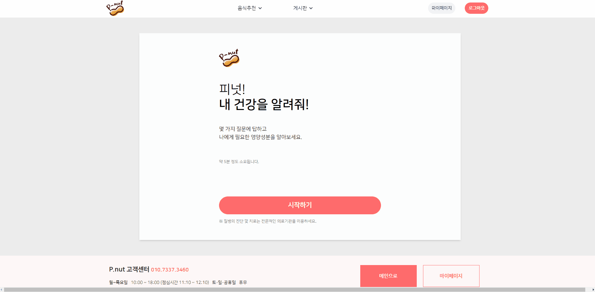
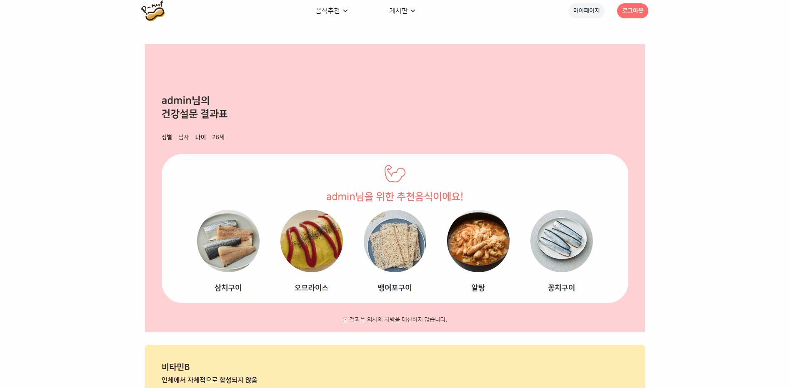
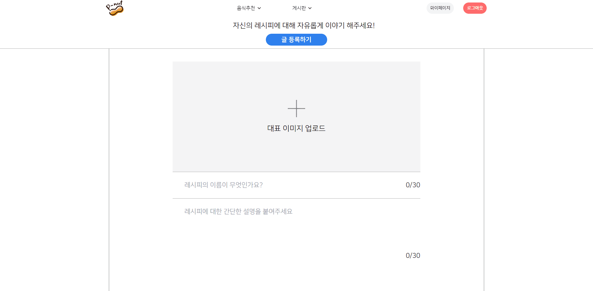
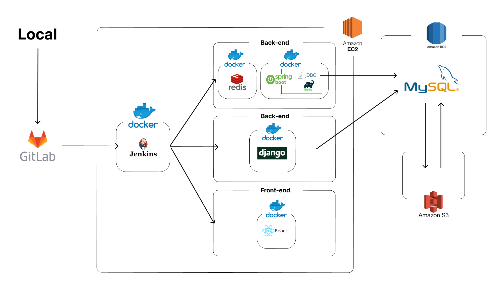
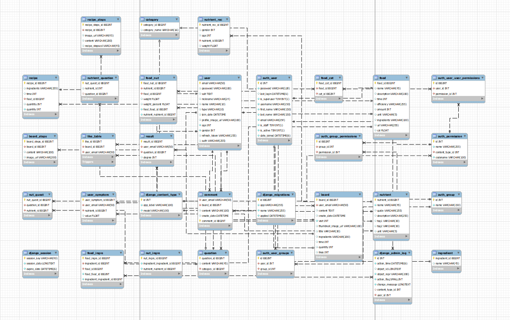

# Pnut - 영양소 분석 기반 음식 추천 서비스

 

## **서비스 페이지: [https://pnut.site](https://pnut.site)** 
 

 

## **프로젝트 기간**
SSAFY 2학기 빅데이터 추천 도메인 특화PJT (2023.02.27 ~ 2023.04.07)

 

## **서비스 개요**

개인별 설문을 통해 부족한 영양소를 우리가 매일 섭취하는 끼니로 채울 수 있도록 맞춤형 음식과 각 음식별 영양수치, 레시피를 추천합니다.

 

****

## **기술 스택**
  - 협업, 버전관리:     
  - 언어:     
  - FE/BE framework:     
  - DB:    
  - CI/CD:   
  - 디자인:   

 

****

 

## **주요 기능**

### **메인페이지**
  - 서비스에 대한 소개와 필요성을 소개합니다. 핵심 기능인 "설문조사", "진단" 페이지로 바로 넘어갈 수 있습니다.
  
    

 

### **설문조사**
  - 실제 질병의 전조증상 기반 설문으로 사용자에게 부족한 영양소를 판단합니다.
  
    

 

### **진단페이지**
  - 설문조사 곃과를 분석하여 사용자에게 부족하다고 판단되는 영양소 3가지를 알려줍니다.
  - 부족한 영양소 수치를 종합하여 음식 5가지를 추천합니다.
  - 영양소의 특징과 섭취 가이드라인을 제시합니다.
  
    

 

### **음식 정보 상세보기**
  - 음식 사진을 클릭하면 음식 세부 정보 모달이 나타납니다.
  - 음식의 설명과 효능, 사진 등 기본적인 정보가 전시됩니다.
  - 사용자의 성별, 연령을 고려한 1일 영양소 권장섭취량과 해당 음식에 포함된 영양소의 비율을 그래프로 한 눈에 볼 수 있습니다.
  - 해당 음식의 레시피 정보를 유튜브 링크로 볼 수 있습니다.
  
    

 

### **보편적인 증상별 음식 검색**
  - 나에게 해당되는 증상 뿐만 아니라 다른 증상으로도 음식을 검색할 수 있습니다.
  
    

 

### **음식 검색 기능**
  - 음식의 이름으로 요리를 검색할 수 있습니다.
  - 음식의 재료로 요리를 검색할 수 있습니다.
  
    

 

### **나만의 레시피 공유 게시판**
  - 나만의 레시피를 공유할 수 있습니다.
  - 추천을 통해 금주의 레시피를 선정하여 상단에 노출됩니다.
  
    

 

## **Architecture**
  

 

## **ERD**
  

 

